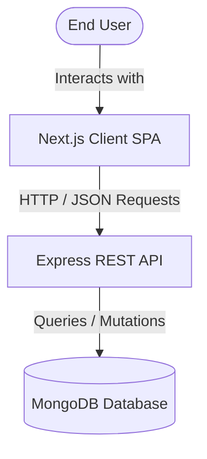
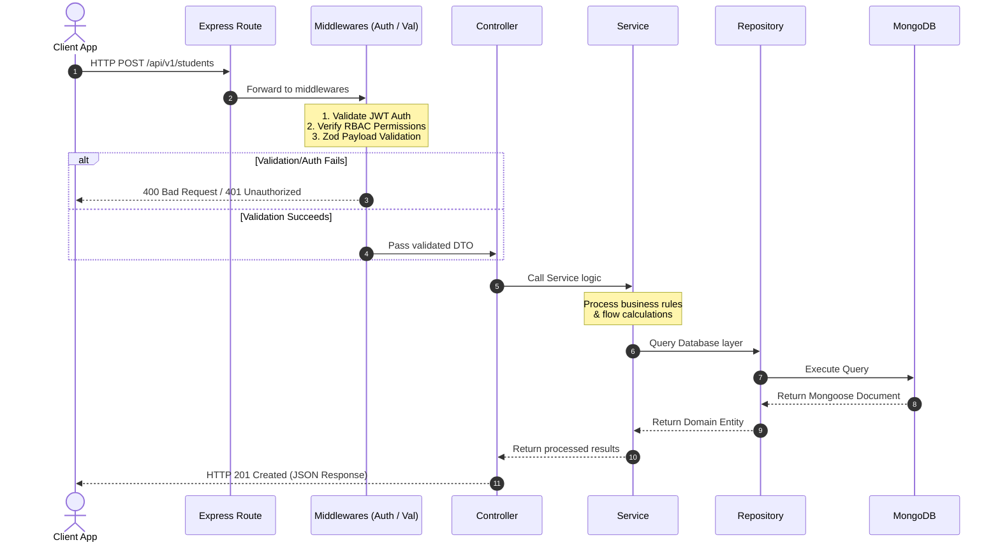

# System Architecture 🏗️

This document describes the high-level architecture, design patterns, and request lifecycle of **CampusFlow**, a modern University ERP system.

---

## 1. System Overview

CampusFlow is designed as a modular 3-tier web application consisting of a React-based Next.js client, an Express/TypeScript REST API server, and a MongoDB database cluster.



---

## 2. Technology Stack

### Frontend Client
* **Core Framework**: Next.js 15+ (App Router)
* **Styling**: Tailwind CSS + Custom Obsidian-glass CSS variables (`globals.css`)
* **State Management**: Redux Toolkit (RTK)
* **Form Handling**: React Hook Form + Zod resolvers
* **API Client**: Axios with dual-token interceptors

### Backend Server
* **Runtime / Compiler**: Node.js 20+ / TypeScript
* **HTTP Framework**: Express.js
* **Database Access**: Mongoose ODM (Object Document Mapper)
* **Data Validation**: Zod schemas
* **Security & Optimization**: Helmet, CORS, Compression, Morgan

### Database
* **Engine**: MongoDB (Document-based NoSQL)

---

## 3. Directory Layouts

### Client Structure
The client follows a **Domain-Driven Design (DDD)** directory layout. All features are isolated into discrete domain folders:

```text
client/
├── app/                  # Next.js App Router Page structures
│   ├── (auth)/           # Authentication layout and login screen
│   └── (dashboard)/      # Protected dashboard screens (Student, Faculty, Admin)
├── features/             # Domain modules containing logic, hooks, types
│   ├── auth/             # Authentication forms, hooks, RTK actions
│   ├── students/         # Student profile edit dialogs, grade summaries
│   ├── timetable/        # Interactive schedules and class calendars
│   └── ...               # Additional feature directories
├── components/           # Generic, reusable UI elements (Buttons, GlassCard, Inputs)
├── lib/                  # Configurations (Axios client, Axios interceptors)
├── store/                # Redux store configuration and root reducers
└── styles/               # Global CSS styles and custom UI tokens
```

### Server Structure
The server matches the client's modular design, encapsulating the entire MVC/Repository stack within dedicated module directories:

```text
server/src/
├── app.ts                # Express application configurations and global middlewares
├── server.ts             # Server entry point (starts server and connects to database)
├── modules/              # Domain-specific modules
│   ├── students/         # Example module: Students
│   │   ├── controllers/  # Receives routes request, processes status, sends responses
│   │   ├── dto/          # Data Transfer Objects (interfaces for request inputs)
│   │   ├── models/       # Mongoose models and schema schemas
│   │   ├── repositories/ # Abstract database access logic
│   │   ├── routes/       # Express route mappings
│   │   ├── services/     # Business logic workflows
│   │   └── validators/   # Zod request validators
│   └── ...               # 20+ additional business modules
├── middlewares/          # Global application middlewares (auth, errors, rate limits)
├── routes/               # API route versioning aggregation (/api/v1/...)
└── shared/               # Shared constants, enums, security mechanisms, utility classes
```

---

## 4. Request Lifecycle

Whenever a request is sent from the CampusFlow frontend client to the backend REST API, it progresses through a pipeline before returning a response:



---

## 5. Key Architectural Patterns

### Dual-Token Authentication
* **Access Tokens**: Short-lived JWTs (typically 15 minutes) sent in the HTTP `Authorization` header (`Bearer <JWT>`). Handled in-memory on the client to mitigate XSS risks.
* **Refresh Tokens**: Long-lived JWTs (typically 7 days) stored in secure, `HttpOnly`, `SameSite=Strict` cookies.
* **Rotation**: Axios interceptors intercept `401 Unauthorized` responses and silently hit `/api/v1/auth/refresh` to fetch a new access token, repeating the failed request without disrupting the user.

### Repository Pattern
To isolate backend database queries, CampusFlow uses repositories:
* Services never interact with Mongoose models directly. They invoke Repository methods (e.g., `this.studentRepository.create(studentData)`).
* This facilitates unit testing by allowing easy mocking of the database access layer.
