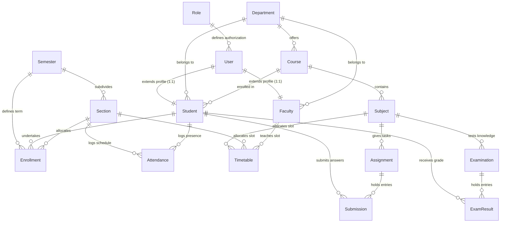

# Database Design 🗄️

This document describes the database design, schema relationships, collection structures, and indexing patterns implemented in CampusFlow.

---

## 1. Overview & Connection Architecture

CampusFlow uses **MongoDB** as its primary datastore, accessed via the **Mongoose ODM**. 

### Core Database Configuration
* **Timestamps**: Enabled by default (`{ timestamps: true }`) on all schemas. This automatically injects `createdAt` and `updatedAt` datetime properties.
* **Soft Deletion**: Implemented using a nullable `deletedAt` field of type `Date`. Rather than running destructive `deleteOne()` operations, data is soft-deleted by setting `deletedAt = new Date()`, preserving historical relational data.
* **ID Format**: Default MongoDB `ObjectId` (`Schema.Types.ObjectId`).

---

## 2. Entity-Relationship Diagram (ERD)

The following Mermaid diagram outlines the primary entity tables and their structural references:

---

## 3. Core Collections & Schema Details

### 3.1. Users (`users`)
Stores the main authentication credentials and personal contact info.

| Field | Type | Modifiers / Validation | Description |
| :--- | :--- | :--- | :--- |
| `_id` | ObjectId | Auto-generated | Primary Key |
| `firstName` | String | Required, Trimmed | User's first name |
| `lastName` | String | Required, Trimmed | User's last name |
| `email` | String | Required, Unique, Lowercase, Trimmed | User's login/notification email |
| `phone` | String | Required, Unique, Trimmed | Contact number |
| `avatar` | String | Default: `""` | Profile photo URL |
| `password` | String | Required, Selected: `false` | Hashed password |
| `isEmailVerified`| Boolean | Default: `false` | Verification status |
| `role` | ObjectId | Ref: `Role`, Required | Authorization role |
| `status` | String | Enum: `UserStatus` | State of the account |
| `lastLogin` | Date | Optional | Recorded last sign-in timestamp |
| `deletedAt` | Date | Default: `null` | Soft deletion time |

---

### 3.2. Students (`students`)
Profiles specific to students, linking to their parent `User` record.

| Field | Type | Modifiers / Validation | Description |
| :--- | :--- | :--- | :--- |
| `user` | ObjectId | Ref: `User`, Required, Unique | Links to authentication profile |
| `studentId` | String | Required, Unique, Uppercase | Academic identifier (e.g., `STU2026001`) |
| `registrationNumber` | String | Required, Unique, Uppercase | State registry number |
| `rollNumber` | String | Required, Trimmed | Class/Section roll number |
| `department` | ObjectId | Ref: `Department`, Required | Major department |
| `course` | ObjectId | Ref: `Course`, Required | Enrolled program |
| `currentSemester` | Number | Required, Min: 1, Max: 12 | Current academic term |
| `admissionYear` | Number | Required, Min: 2000 | Year student joined the program |
| `admissionType` | String | Enum: `AdmissionType` | e.g., `REGULAR`, `LATERAL` |
| `dateOfBirth` | Date | Required | Birthday |
| `gender` | String | Enum: `Gender`, Required | Gender classification |
| `bloodGroup` | String | Enum: `BloodGroup`, Required | Blood group |
| `guardianName` | String | Required | Parent/Guardian full name |
| `guardianPhone` | String | Required | Parent/Guardian emergency phone |
| `address` | String | Required | Physical address |
| `status` | String | Enum: `StudentStatus` | e.g., `ACTIVE`, `SUSPENDED`, `ALUMNI` |

---

### 3.3. Faculty (`faculties`)
Profiles specific to professors and academic staff.

| Field | Type | Modifiers / Validation | Description |
| :--- | :--- | :--- | :--- |
| `user` | ObjectId | Ref: `User`, Required, Unique | Links to authentication profile |
| `employeeId` | String | Required, Unique, Uppercase | Employee identifier (e.g., `EMP2026101`) |
| `department` | ObjectId | Ref: `Department`, Required | Hosting department |
| `designation` | String | Enum: `Designation`, Required | e.g., `PROFESSOR`, `LECTURER` |
| `qualification` | String | Required | Academic degree details |
| `specialization` | String | Required | Domain specialization |
| `experience` | Number | Required, Min: 0 | Years of teaching experience |
| `joiningDate` | Date | Required | Date joined the institution |
| `employmentType` | String | Enum: `EmploymentType` | e.g., `FULL_TIME`, `PART_TIME` |
| `status` | String | Enum: `Status` | Active status in the system |

---

### 3.4. Departments (`departments`)
Departments organizing programs, faculty, and academic units.

| Field | Type | Modifiers / Validation | Description |
| :--- | :--- | :--- | :--- |
| `name` | String | Required, Unique, Trimmed | e.g., `Computer Science & Engineering` |
| `code` | String | Required, Unique, Uppercase | e.g., `CSE` |
| `description` | String | Optional | Short description |
| `status` | String | Enum: `Status` | Operational status of the department |

---

## 4. Indexing Strategy

Indexing is critical to maintain low response times across large student rosters, schedules, and attendance histories.

### 4.1. Single-Field Indexes
Created for high-cardinality values frequently queryable on dashboards and lists:
* `students.rollNumber`
* `students.status`
* `students.admissionYear`
* `faculties.designation`

### 4.2. Compound Indexes
Optimized for complex queries containing filters combined with sorting:
* `students.index({ course: 1, currentSemester: 1 })`: Used to fetch class lists.
* `students.index({ department: 1, currentSemester: 1 })`: Speeds up department metrics cards.
* `students.index({ course: 1, currentSemester: 1, status: 1 })`: Filters active students by class rosters.
* `faculties.index({ department: 1, status: 1 })`: Filters active department staff lists.

### 4.3. Text Search Indexes
Enables multi-field global search bars on dashboards without relying on slow regex lookups:
* `faculties.index({ specialization: "text", qualification: "text" })`
